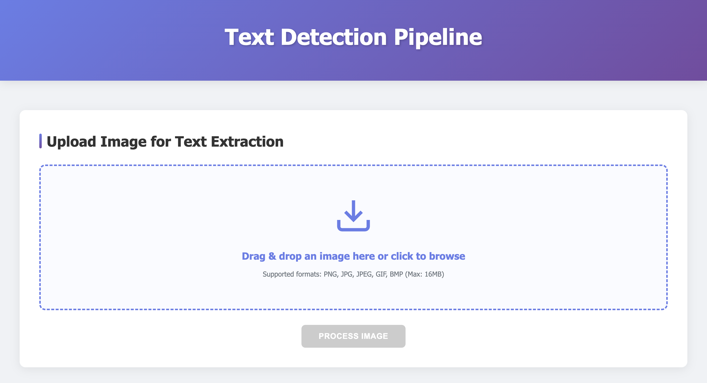
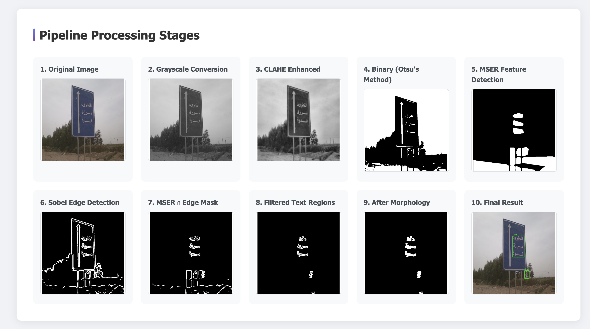
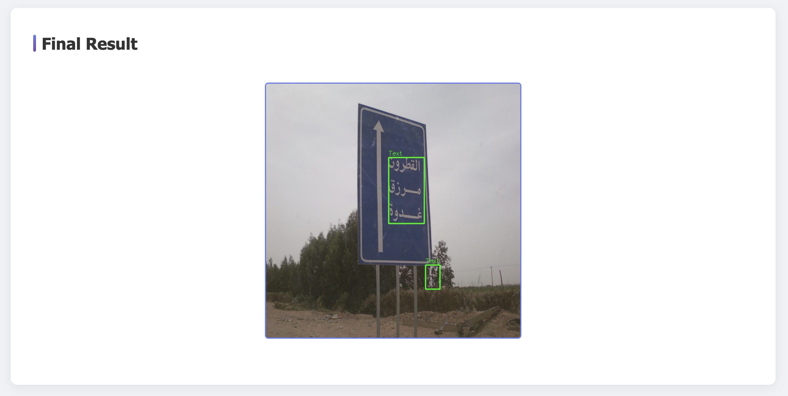

# Text Extraction Pipeline 

A robust text detection and extraction system using MSER (Maximally Stable Extremal Regions) and Sobel Edge Detection algorithms. This pipeline provides a comprehensive solution for detecting and localizing text regions in images through advanced computer vision techniques.

## 🌟 Features

- **Advanced Text Detection**: Combines MSER and Sobel Edge Detection for robust text localization
- **Multi-Stage Processing Pipeline**: 10-step image processing workflow for optimal results
- **Web Interface**: User-friendly Flask web application with drag-and-drop functionality
- **Real-time Visualization**: View each processing stage with interactive image viewer
- **Modular Architecture**: Clean, maintainable code structure with separated concerns
- **Configurable Parameters**: Easily adjustable detection thresholds and parameters

## 📁 Project Structure

```
text-extraction-pipeline/
├── app.py                      # Flask web application
├── config.py                   # Configuration parameters
├── text_extraction.py          # Main pipeline orchestrator
├── preprocessing.py            # Image preprocessing module
├── mser_detector.py           # MSER detection module
├── edge_detector.py           # Edge detection module
├── region_filter.py           # Region filtering module
├── morphology_operations.py   # Morphological operations
├── region_merger.py           # Region merging module
├── image_utils.py             # Image processing utilities
├── utils.py                   # General utilities
├── requirements.txt           # Python dependencies
├── templates/
│   └── index.html            # Web interface template
└── uploads/                   # Temporary upload directory
```

## 🚀 Installation

### Prerequisites

- Python 3.8 or higher
- pip package manager
- Virtual environment (recommended)

### Step 1: Clone the Repository

```bash
git clone https://github.com/yourusername/text-extraction-pipeline.git
cd text-extraction-pipeline
```

### Step 2: Create Virtual Environment

```bash
# Create virtual environment
python -m venv venv

# Activate virtual environment
# On Windows
venv\Scripts\activate
# On macOS/Linux
source venv/bin/activate
```

### Step 3: Install Dependencies

```bash
pip install -r requirements.txt
```

## 💻 Usage

### Running the Application

1. **Navigate to the project directory:**

```bash
cd text-extraction-pipeline
```

2. **Activate the virtual environment:**

```bash
# On Windows
venv\Scripts\activate

# On macOS/Linux
source venv/bin/activate
```

3. **Set the Flask application environment variable:**

```bash
# On Windows
set FLASK_APP=app.py

# On macOS/Linux
export FLASK_APP=app.py
```

4. **Run the Flask application:**

```bash
flask run
```

5. **Open your browser and paste the link:**

```
http://127.0.0.1:5000
```

6. **Upload an image:**
   - Drag and drop an image onto the upload area
   - Or click to browse and select an image
   - Supported formats: PNG, JPG, JPEG, GIF, BMP
   - Maximum file size: 16MB


## 📊 Results

### Web Interface


The web interface provides an intuitive drag-and-drop area for uploading images and displays real-time processing status.

### Processing Pipeline Visualization

The pipeline processes images through 10 distinct stages:



### Final Result



### Results on the ICDAR 2017 text dataset

